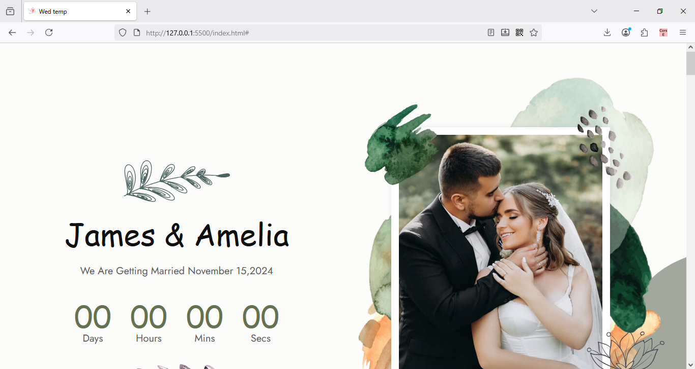
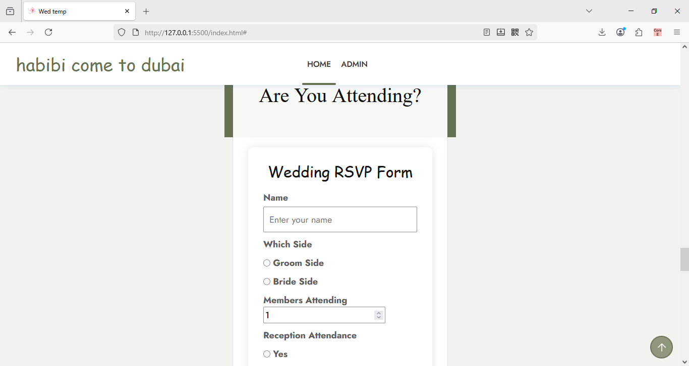
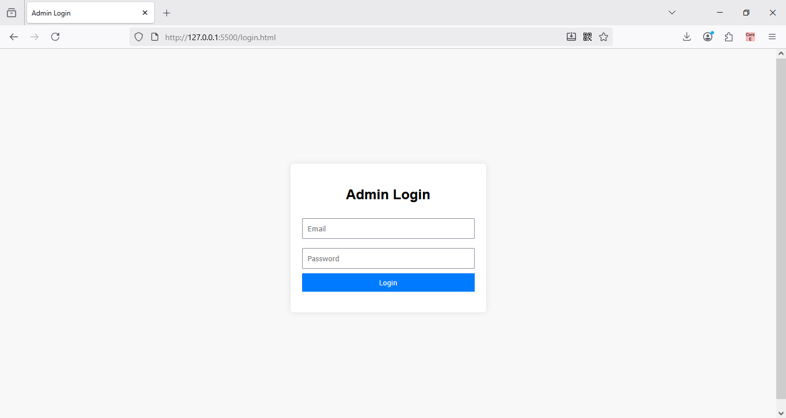
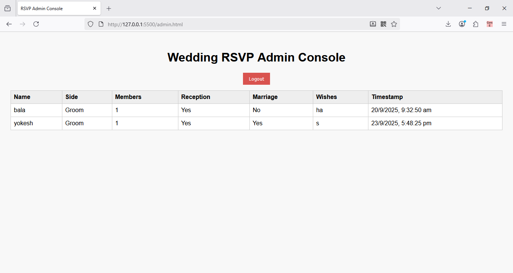

💍 Wedding Invitation & RSVP Web App

A responsive wedding invitation website with an RSVP form and an admin dashboard to manage guest responses — built using HTML, CSS, JavaScript, Firebase Authentication, and Firebase Realtime Database. Hosted on Netlify.

✨ Features

🎨 Digital Invitation Page — elegant and mobile-friendly

📝 RSVP Form — guests can confirm attendance and send wishes

🔒 Admin Login — secure login using Firebase Authentication

📊 Realtime Database — RSVP data stored instantly in Firebase

📋 Admin Dashboard — view guest responses in real time

📸 Screenshots

Invitation Page	      

	

 RSVP Form

Admin Login

Admin Console

wedding-rsvp/

├── index.html        # Wedding invitation page

├── rsvp.html         # Guest RSVP form

├── login.html        # Admin login page

├── admin.html        # Admin dashboard

├── /assets           # Images, CSS, JS

└── README.md

🛠️ Tech Stack

Frontend: HTML5, CSS3, Vanilla JavaScript

Backend: Firebase Realtime Database

Auth: Firebase Authentication (Email/Password)

Hosting: Netlify

🚀 Getting Started
1️⃣ Clone the Repository

git clone https://github.com/Yokesh1234/Wedding-page.git

cd Wedding-page

2️⃣ Set Up Firebase

Go to Firebase Console

Create a new Firebase project.

Enable Authentication → Email/Password.

Create a Realtime Database.

Copy your Firebase config object and replace it inside:

login.html

admin.html

3️⃣ Configure Admin Email

In login.html and admin.html you’ll see:

if (user.email.toLowerCase() === "youremail@gmail.com") {
  // admin allowed
}

Replace with your admin email.

4️⃣ Run Locally

Use VS Code Live Server or similar:

npx live-server

Then open http://127.0.0.1:5500/index.html.

5️⃣ Deploy to Netlify

Create a free account at Netlify

Click New site from Git.

Connect your GitHub repo.

Build settings:

Base directory: /

Build command: none (static site)

Publish directory: /

Click Deploy.

Netlify will give you a public URL like https://yourproject.netlify.app.

🔑 Admin Login

Create an admin user in Firebase Authentication (email/password).

Only this email can access admin.html.

Other users trying to log in will be denied.

🔒 Security Tips

Restrict your Firebase API keys in the Google Cloud console.

Set proper Firebase Realtime Database Rules

Example rules:
{
  "rules": {
    "weddingRSVP": {
      ".read": "auth != null",
      ".write": "true"
    }
  }
}

🙏 Acknowledgements

Firebase for Authentication & Database
Netlify for hosting

✅ How to use:

Copy this text into your README.md.

Add screenshots to a screenshots folder and update image paths.

Commit & push to GitHub.